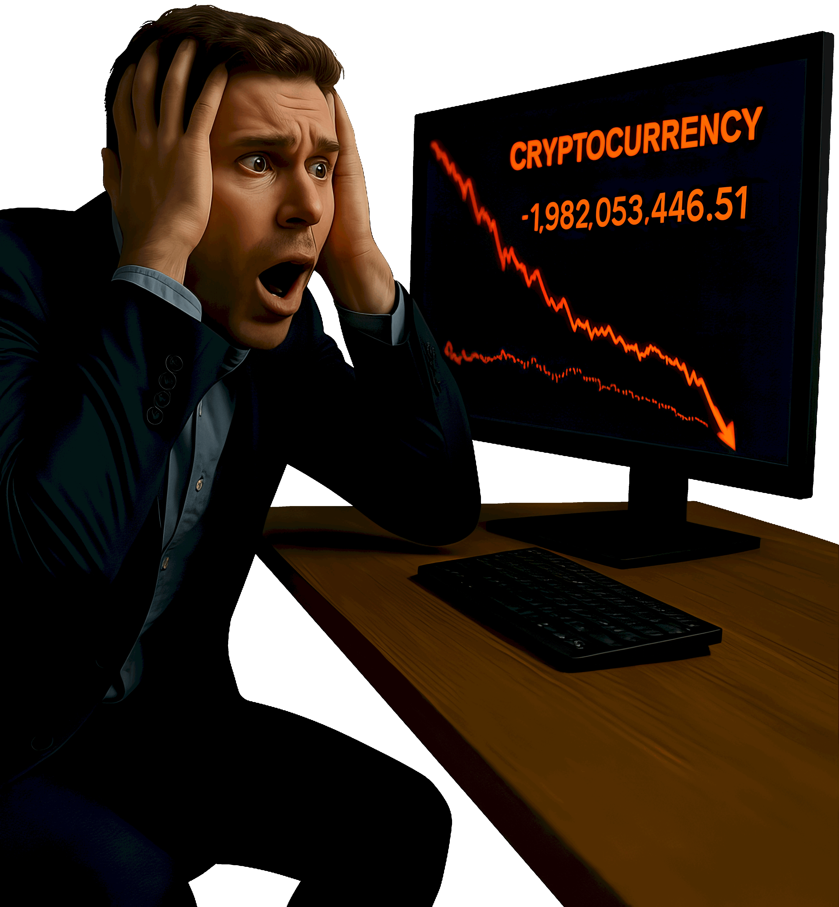

# We Are Not Ready: Why 90% of Newbies Fail Before the Third Week. What Do We Do Wrong?
Alright, let's get brutally real for a second. Forget the inspirational stories and gentle warnings; they're lies we tell ourselves to be able to sleep at night and/or pretend to exist so we can feel special. We are not ready, as plain as day, because 90% of people who dip their toes into crypto trading fail spectacularly, often within less than three weeks. —Give it a guess! The reason? It's rarely about skills, but rather it’s because we fundamentally misunderstand what "ready" even means in this context and actively sabotage ourselves with predictable newbie mistakes.

## The Chase is Always for the Flashy Exit
We often see almost everywhere the statement "Buy $BTC on its dip!" or "$XRP is going to pump 50% tomorrow because???", which in the real world are not strategies; they're invitations for disaster. Are we seriously trying the same tactics that got your USD 1,249 'investment' wiped out in a single FOMO-driven trade based on some anonymous Twitter tip, or last week's price chart wobble. Did it work? Only a miracle from the heavens, hell, and everything in between, would make those strategies work. Look at any major crypto forum —Reddit's r/CryptoCurrency comes to mind— from the past year and filter by "trades gone wrong" and see how many threads start with someone saying, _"I just put my first USD XXX into $BTC/$ETH"_ along with some other bunch of disgraceful remarks, followed shortly after not a profitable withdrawal but an urgent plea for help, because we bought at ATH (All-Time High), panicked, sold too low during the inevitable dip, or even worse yet, bought again immediately on that very same fear without understanding why it dropped, let alone doing any fundamental analysis.

The sheer volume of posts where people lose their initial stake within days isn't anecdotal. Call me a cynical, but I would argue that most loss threads are variations of this very same case. We haven’t learned the basics because we felt we didn‘t need to. All that mattered was hitting a button after believing the catchy phrase _"the future is here"_. —Yeah, right! It should be read as _"The disaster is here"_, instead.

## The Leverage on Our Tiny Account As if It's an Online Slot Machine
This one’s particularly insidious and deserves its own spotlight. Do we think buying ten bucks worth of $BTC with our first dollars feels risky? Try it, but with leverage! Borrowing someone else‘s money to amplify our investment. That makes it feel like a sure thing, or at least manageable, but it doesn‘t. Is the thought process _"My account is small anyway; I'll just use a 5x lever on this dip!"_ gives us any pause? Does that sound remotely intelligent?

Leverage trading isn't rocket science, but it is amplified risk. Leverage makes a tiny mistake become a massive one. Case in point, we put those ten bucks into $ETH with a 5x leverage, so we control a ~$49-ish position. We buy at the top of an hour-long pump-and-dump scam orchestrated by bots specifically targeting micro-accounts like ours, and it crashes hard within minutes. Our loss? Not just our initial stake that's wiped out instantly because 10 × (-25%) = -$378, but wait, it doesn‘t stop there. Because the leverage automatically liquidates positions when losses hit certain thresholds, often set by brokers. So, if our trade goes against them on that leveraged $ETH position due to slippage or a sudden crash during withdrawal attempts, our ten bucks account is gone. We've lost more than we invested because of the way leverage liquidates. Then comes the third week, and in our minds the belief _"I thought I was ready, but my tiny first-time trade with a 5x lever just vanished."_ Or worse, our initial deposit wasn't wiped out by a loss at all, it felt good for maybe two weeks until fees or taxes ate into that small amount. Now we're frustrated and looking to double down on leverage, which is the fastest way from "newbie" straight back to a zero balance.

## It isn't The Lack of Skills, it's Plain Stupidity
Let's stop pretending that we need advanced skills like seasoned market veterans have before even understand basic mechanics or having any capital at risk. The 90% failure rate isn't because we're inherently bad people who just got unlucky. —Though luck plays an undeniable —No-Role— here. It’s primarily due to unrealistic expectations, which is believing crypto trading is a shortcut lottery ticket instead of the complex financial instrument it actually is. We don‘t _"get ready"_ by expecting exponential gains overnight, add to that the fundamental lack or disregard for preparation, jumping in without understanding market volatility, which can destroy ten bucks, and make it even worse by doing it with leverage. On "Week 1" we think buying $BTC is the de facto trade, because it's the most established coin, that is still a testament of being fundamentally unprepared. The market doesn't care about our timeline; price moves happen faster than we can even blink.

## Bottom Line
We are not ready to trade crypto seriously until we understand that failure is statistically probable for those who act like gamblers rather than investors, or beginners pretending they‘re experts armed with nothing but hype and a tiny deposit. The third week isn't the magic point where everyone thinks _"I get it"_. It's often just when most people thinks _"Oh Crap!"_. So let's stop looking at ourselves as if we're on some elite trading path before week 1 is even over, because statistically, we‘re not!

Let's get a grip and start learning what actually matters, i.e. risk management, which  includes knowing our limits, security best practices for our specific setup —$0.98 fee account + leverage = instant $37 loss?—, understanding market mechanics beyond headlines or coin names alone. With these simple insights, then maybe, just maybe, after weeks of painful education rather than quick gains chasing you down the drain, we'll be ready to trade without immediately bankrupting ourselves and everyone else who thinks week #1 is a good time for financial freedom.
